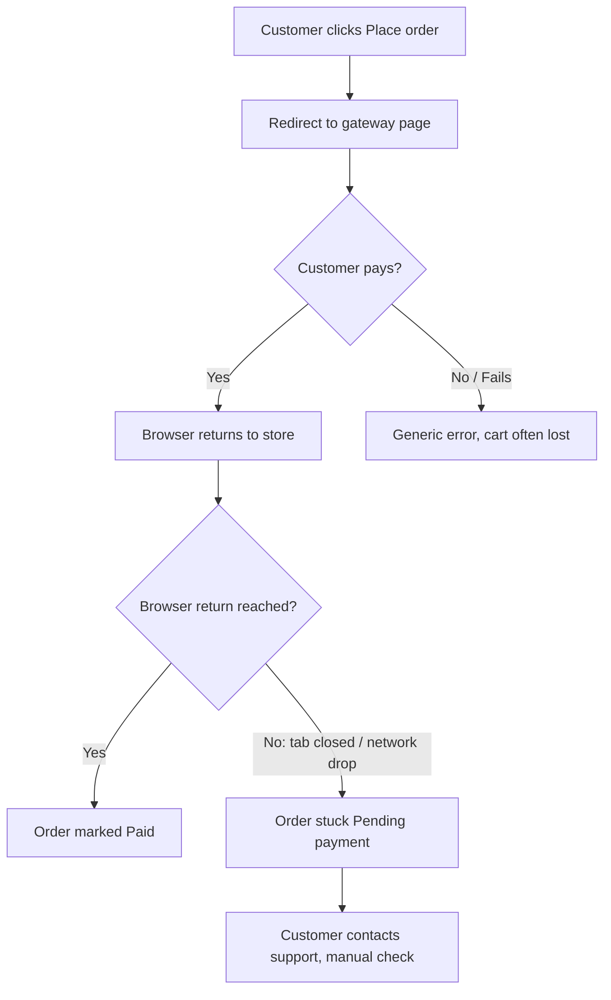
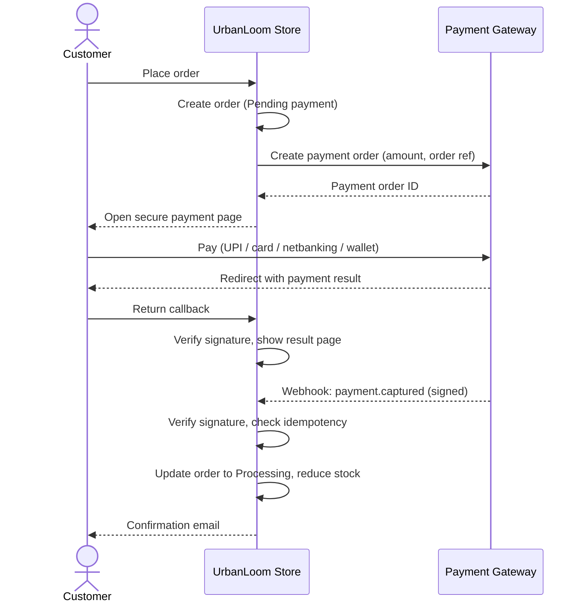
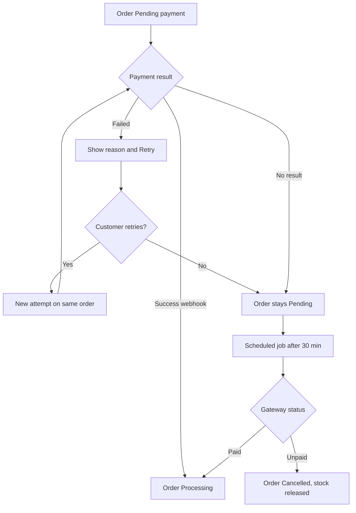
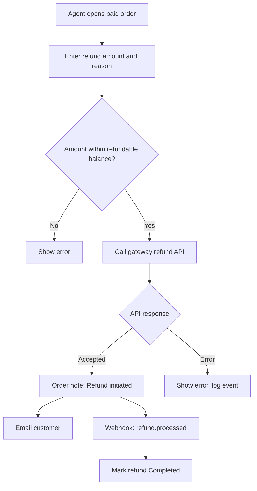

# Process Flows

## 1. As-is checkout (problem state)

```mermaid
flowchart TD
    A[Customer clicks Place order] --> B[Redirect to gateway page]
    B --> C{Customer pays?}
    C -- Yes --> D[Browser returns to store]
    D --> E{Browser return reached?}
    E -- Yes --> F[Order marked Paid]
    E -- No: tab closed / network drop --> G[Order stuck Pending payment]
    C -- No / Fails --> H[Generic error, cart often lost]
    G --> I[Customer contacts support, manual check]
```

## 2. To-be checkout and payment confirmation

```mermaid
sequenceDiagram
    actor C as Customer
    participant S as UrbanLoom Store
    participant G as Payment Gateway
    C->>S: Place order
    S->>S: Create order (Pending payment)
    S->>G: Create payment order (amount, order ref)
    G-->>S: Payment order ID
    S-->>C: Open secure payment page
    C->>G: Pay (UPI / card / netbanking / wallet)
    G-->>C: Redirect with payment result
    C->>S: Return callback
    S->>S: Verify signature, show result page
    G-->>S: Webhook: payment.captured (signed)
    S->>S: Verify signature, check idempotency
    S->>S: Update order to Processing, reduce stock
    S-->>C: Confirmation email
```

## 3. Failure, retry and expiry

```mermaid
flowchart TD
    A[Order Pending payment] --> B{Payment result}
    B -- Success webhook --> C[Order Processing]
    B -- Failed --> D[Show reason and Retry]
    D --> E{Customer retries?}
    E -- Yes --> F[New attempt on same order]
    F --> B
    E -- No --> G[Order stays Pending]
    B -- No result --> G
    G --> H[Scheduled job after 30 min]
    H --> I{Gateway status}
    I -- Paid --> C
    I -- Unpaid --> J[Order Cancelled, stock released]
```

## 4. Refund flow

```mermaid
flowchart TD
    A[Agent opens paid order] --> B[Enter refund amount and reason]
    B --> C{Amount within refundable balance?}
    C -- No --> D[Show error]
    C -- Yes --> E[Call gateway refund API]
    E --> F{API response}
    F -- Accepted --> G[Order note: Refund initiated]
    G --> H[Email customer]
    G --> I[Webhook: refund.processed]
    I --> J[Mark refund Completed]
    F -- Error --> K[Show error, log event]
```
